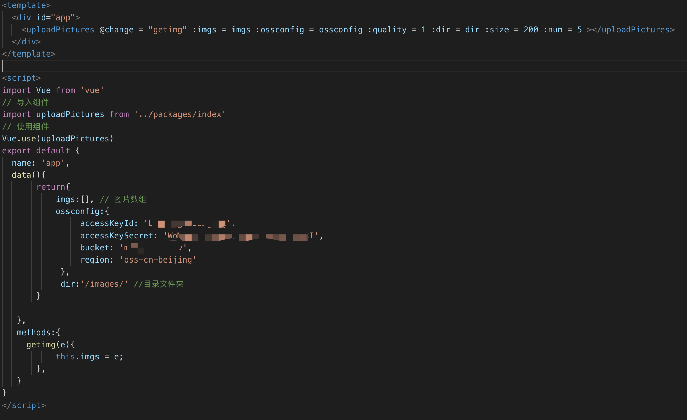

# alioss-uploadpictures
[](https://www.npmjs.com/package/alioss-uploadpictures)


## Introduction

一个通过传递alioss配置参数即可上传图片的插件。附件功能包括限制图片大小（kb），限制上传张数，压缩图片质量（0-1），以及预览大图。

## example

[
## Quick start
```js
yarn add alioss-uploadpictures
```
```js
import Vue from 'vue'
```
```js
import uploadPictures from 'alioss-uploadpictures'
```
```js
Vue.use(uploadPictures)
```
## params
    ```js
    //图片数组
    imgs: Array,
    //oss配置参数
    ossconfig:Object,
    //压缩质量 0 到 1
    quality:{
      type: Number,
      default: 1
    },
    // 目录
    dir:{
      type: String,
      default: ''
    },
    //限制大小kb
    size:{
      type: Number,
      default: 0
    },
    //限制数量
    num:{
      type: Number,
      default: 0
    }
    ```